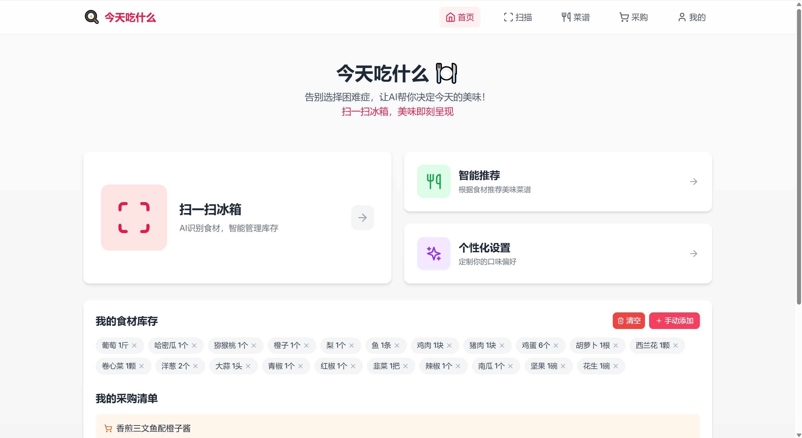
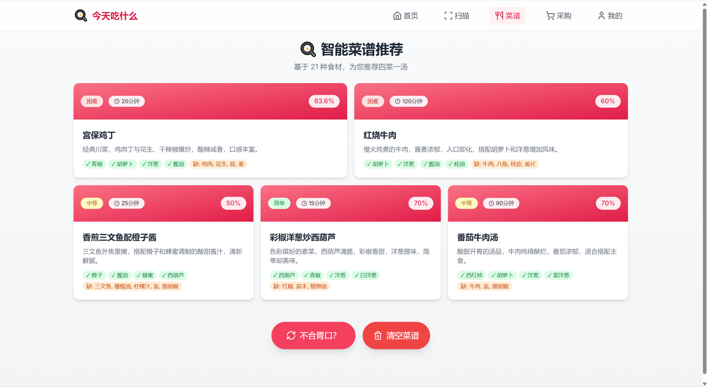
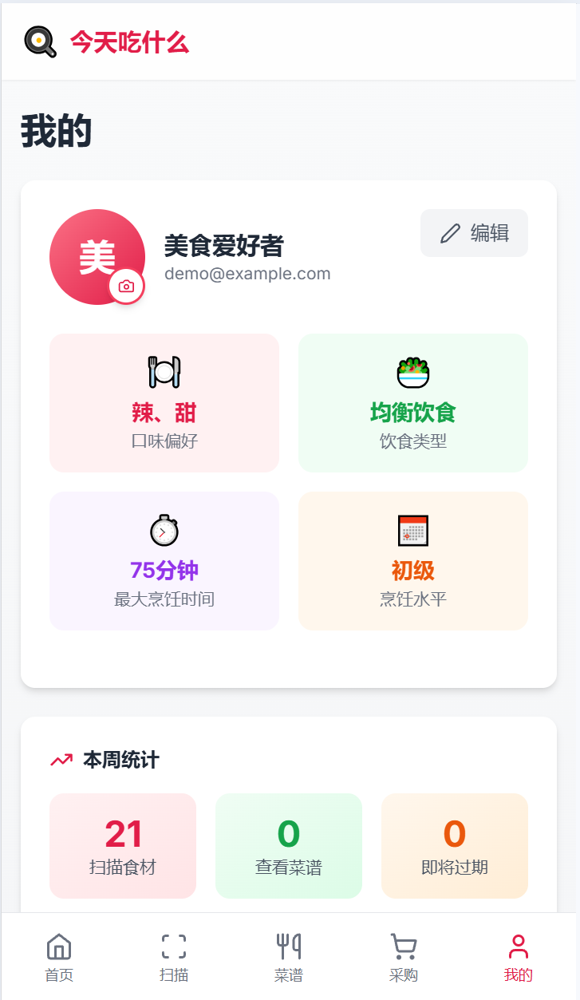

# What2Eat - AI Hackathon Tour 初赛项目文档

## 一、项目简介

**What2Eat（今天吃什么）** 是一款面向家庭与个人的 **AI 智能饮食决策助手**，聚焦于日常生活中高频却被长期忽视的真实问题——**“今天吃什么”**。项目围绕「**库存可见 → 决策推荐 → 烹饪执行 → 采购补全**」这一完整饮食链路展开，核心能力包括：

- **扫一扫冰箱**：通过图像识别快速获取当前可用食材
- **多约束菜谱推荐**：基于库存、口味偏好、饮食类型、烹饪时间等条件生成候选菜谱
- **烹饪过程引导**：将推荐从“结果”延伸到“执行”，降低实际下厨门槛
- **智能采购清单**：对比菜谱与库存，自动生成缺口食材清单



在技术架构上，前端采用 **React + Vite** 构建高响应 UI，后端使用 **FastAPI** 提供轻量 API 服务，数据层以 **Supabase** 为主，并设计了 Demo 模式下无数据库可运行的兜底方案，确保项目在 Hackathon、展示与弱网络环境中依然可完整体验。

项目目标并非“做一个菜谱大全”，而是通过 AI 将饮食决策从模糊、纠结、浪费，转变为可执行、可持续、可扩展的智能流程。

代码仓库：https://github.com/Yepiphany/what2eat

## 二、业务价值

### 1. 减少浪费与成本控制

- 将“现有库存优先使用”作为推荐系统的硬约束，减少因遗忘或过期造成的食材浪费
- 菜谱与采购清单联动，仅对“真正缺失”的食材给出补充建议，避免冲动式、重复式购买

### 2. 提升决策效率与满意度

- 将口味偏好、饮食类型、最大烹饪时间、烹饪水平等因素结构化建模
- 从“我该想吃什么”转变为“系统直接给我可行选项”，显著降低每日决策成本

### 3. 健康与饮食合规

- 支持素食、纯素、低碳、高蛋白等饮食类型
- 为长期健康管理（如控糖、减脂、均衡饮食）提供可持续执行的技术基础

### 4. 生态与商业合作潜力

- 可与商超、生鲜、电商平台对接，基于库存缺口生成精准采购建议
- 在用户匿名化前提下，形成食材使用趋势与菜谱偏好分析能力，为 B 端提供数据价值

## 三、AI 创新性

### 1. 个性化多约束推荐机制

不同于单一口味或评分排序，What2Eat 的推荐逻辑同时考虑：

- 可用食材集合（硬约束）
- 用户口味偏好（软约束）
- 饮食类型（规则约束）
- 最大烹饪时间与烹饪水平（可执行性约束）

从“好不好吃”升级为“我现在能不能做、愿不愿意做”。

### 2. 从识别到行动的完整功能链路

项目并非孤立功能堆叠，而是形成清晰闭环：

> **冰箱识别 → 菜谱推荐 → 烹饪引导 → 采购补全**

每一步都直接服务于下一步的可执行性，避免“推荐完就结束”的断层体验。

### 3. 前后端协同的轻缓存与分页策略

- 后端提供分页接口，避免一次性生成或拉取大量菜谱
- 前端对分页结果进行缓存与清理控制，减少重复请求与生成成本
- 在 AI 生成场景下有效平衡响应速度、成本与体验

### 4. Demo 模式下的鲁棒性设计

- 在 Supabase 不可用、未配置或网络受限情况下：
  - 后端自动切换至 StubClient
  - 核心接口返回占位或空数据而非直接失败
- 保证项目在评审、展示与快速部署场景中能正常体验

## 四、技术实现说明

### 1. 前端技术栈

- **React + Vite**：快速构建与热更新
- **Zustand**：轻量状态管理，覆盖用户、食材、菜谱、购物清单等核心状态

#### 页面结构

- 主页：智能推荐入口、核心状态卡片
- 个人页：用户信息、偏好设置、统计信息整合
- 菜谱列表 / 详情页
- 购物清单页



#### 偏好管理与接口封装

- 用户偏好通过 `PUT` 请求以 JSON Body 形式提交
- 前后端枚举字段（如 DietType、TastePreference）保持严格一致

#### 细节体验优化

- 支持响应式布局

  

- 主页卡片 Hover 边框抖动问题：

  - 使用 `border-2 border-transparent` 预占空间
  - Hover 时仅改变颜色不改变宽度

- 动画统一使用过渡类与 `group-hover`，保证交互一致性

### 2. 后端技术栈

- **FastAPI**：高性能异步 API 框架
- 路由模块化设计：
  - `ingredients`
  - `recipes`
  - `users`
  - `shopping`
  - `recipe_pages`
  - `cooking`

#### Supabase 客户端与 Demo 模式兜底

- 启动时检测环境变量是否存在
- 初始化失败或未配置时自动启用 StubClient
- 所有数据库调用接口保持一致，避免业务代码分叉

```python
def get_supabase_client() -> Client:
    global supabase
    
    if supabase is None:
        if not SUPABASE_URL or not SUPABASE_KEY:
            class _StubResult:
                data = []
            class _StubQuery:
                def select(self, *args, **kwargs): return self
                def insert(self, *args, **kwargs): return self
                def update(self, *args, **kwargs): return self
                def delete(self, *args, **kwargs): return self
                def eq(self, *args, **kwargs): return self
                def order(self, *args, **kwargs): return self
                def limit(self, *args, **kwargs): return self
                def execute(self): return _StubResult()
            class _StubClient:
                def table(self, name): return _StubQuery()
            supabase = _StubClient()
        else:
            try:
                supabase = create_client(SUPABASE_URL, SUPABASE_KEY)
            except Exception as e:
                print(f"Warning: Failed to initialize Supabase client: {e}")
                print("Some features may not work without database connection.")
                class _StubResult:
                    data = []
                class _StubQuery:
                    def select(self, *args, **kwargs): return self
                    def insert(self, *args, **kwargs): return self
                    def update(self, *args, **kwargs): return self
                    def delete(self, *args, **kwargs): return self
                    def eq(self, *args, **kwargs): return self
                    def order(self, *args, **kwargs): return self
                    def limit(self, *args, **kwargs): return self
                    def execute(self): return _StubResult()
                class _StubClient:
                    def table(self, name): return _StubQuery()
                supabase = _StubClient()
    
    return supabase
```


#### 用户偏好接口设计

- 使用枚举类型约束输入合法性
- 动态构建更新字段，仅修改实际传入项
- 保证接口安全性与可扩展性

### 3. 运行与配置

- 前端：`npm run dev`（默认 `5173`）
- 后端：`uvicorn main:app --reload`（默认 `8000`）

#### 环境变量

- `backend/.env`
  - `SUPABASE_URL`
  - `SUPABASE_KEY`
  - `MODELSCOPE_BASE_URL`
  - `MODELSCOPE_API_KEY`
  - `MODELSCOPE_VISION_MODEL`
  - `IMAGE_MODEL`
- `frontend/.env`
  - `VITE_API_URL`
  - `VITE_SUPABASE_URL`
  - `VITE_SUPABASE_ANON_KEY`

#### Demo 模式

- 未配置 Supabase 仍可完整体验主流程
- 数据库相关接口返回占位或空数据

## 五、交互与设计

### 主页入口卡片

- 智能推荐 / 个性化设置 / 扫一扫冰箱
- 固定边框宽度 + 颜色变化 Hover，避免布局抖动
- 清晰区分“行动入口”与“信息展示”

### 个人页与偏好设置

- 个人信息、统计与设置统一纵向布局
- 偏好拆分为四个独立弹窗：
  - 口味偏好
  - 饮食类型
  - 最大烹饪时间
  - 烹饪水平
- 每张卡片只负责一个决策，降低认知负担

### 错误处理与兜底体验

- 数据库不可用时给出非阻塞提示
- 偏好保存失败时：
  - 前端本地立即更新
  - 后端恢复后可重新同步
- 优先保证“用户流程不断裂”

## 六、落地与扩展

### 数据安全与隐私

- Demo 模式不持久化任何用户数据
- 生产环境建议：
  - 启用 Supabase RLS
  - 使用 HTTPS
  - 严格限制跨用户访问

### 商业与产品扩展

- 对接电商 / 生鲜平台 API
- 一键采购、会员推荐、优惠匹配
- 健康评分、营养摄入分析与长期目标管理

### 技术演进方向

- 引入 Embedding + 向量检索提升菜谱匹配质量
- 规则模型 + LLM 组合，平衡可控性与生成多样性
- 完善图像识别 pipeline，应对复杂冰箱场景