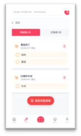
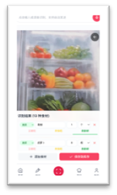
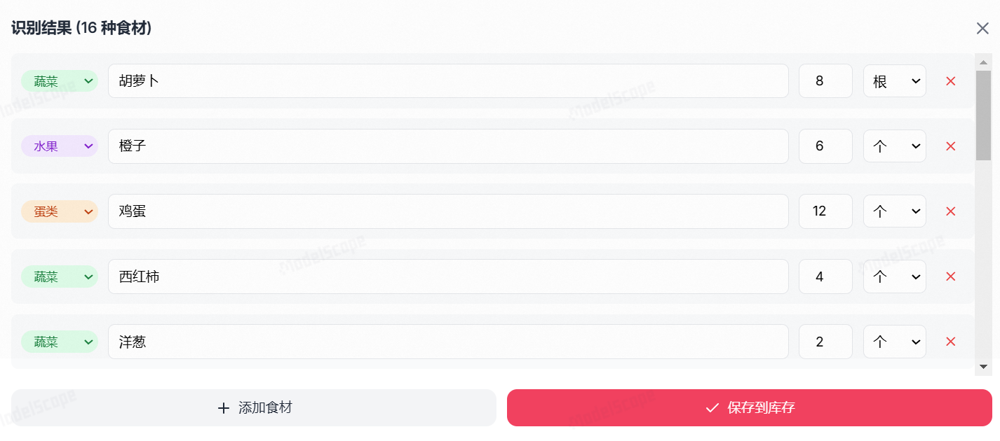
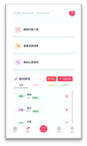
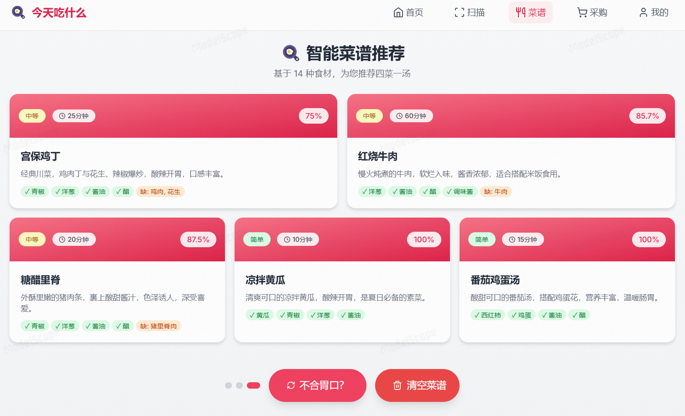
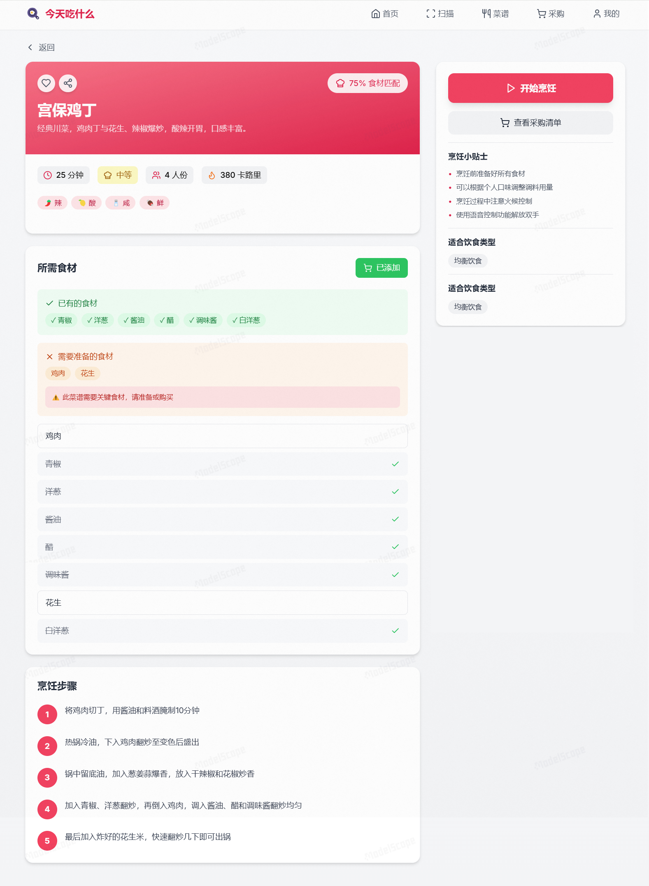
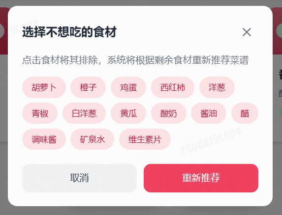
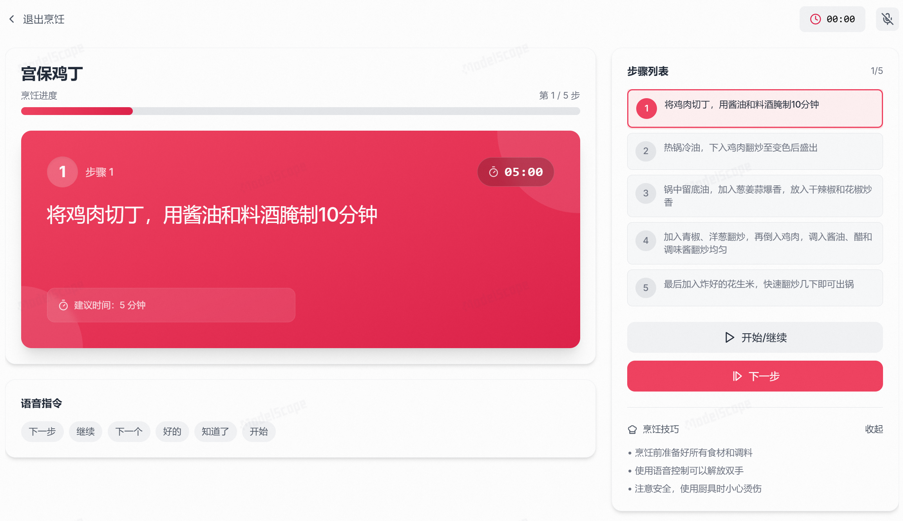
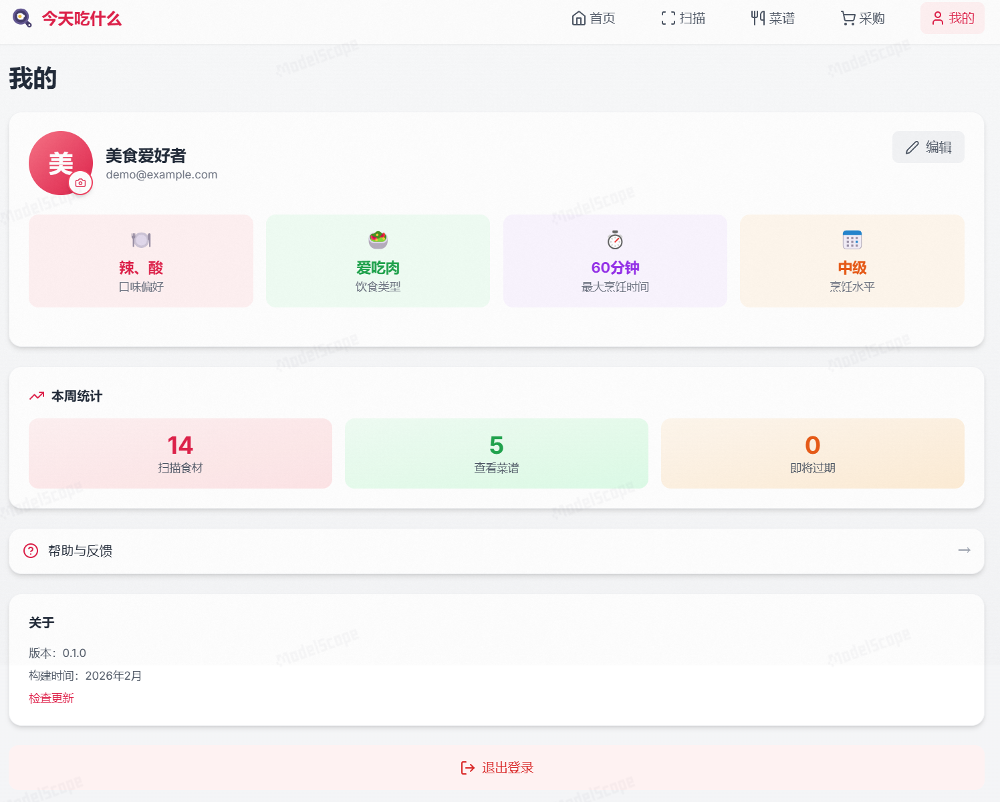

# What2Eat 今天吃什么

## 一、项目简介

### **What2Eat 今天吃什么** 是一款面向家庭与个人的**一站式AI 智能饮食决策助手**，聚焦于日常生活中高频真实问题——**“今天吃什么？”**。


### 亮点功能

#### 一站式AI 智能饮食决策助手

项目围绕「**库存可见 → 决策推荐→ 采购补全 → 烹饪执行**」这一完整饮食链路展开，核心能力包括：

- **扫一扫冰箱**：通过AI图像识别快速获取当前冰箱内已有食材
- **多约束菜谱推荐**：基于已有食材库存、口味偏好、饮食类型、最大烹饪时间、烹饪水平等条件生成候选菜谱
- **智能采购清单**：对比菜谱与库存，自动生成缺口食材清单，以便用户可轻松完成采购
- **烹饪过程引导**：将推荐从“结果”延伸到“执行”，降低实际下厨门槛

#### 全局语音助手 - 栗子

栗子是贯穿全站的语音交互入口，支持“说一句就执行”的自然语言操作，降低手动输入成本，尤其适合做饭前后双手不便打字的场景。

**核心能力**：

- **语音识别 + 文本输入双通道**：支持浏览器语音识别，不支持语音的环境自动退化为文本输入
- **库存语音入库**：可识别“今天买了一斤猪肉、三个番茄”这类自然表达，自动解析食材名、数量、单位与分类
- **心想食材管理**：支持语音添加、删除、清空“心想食材”，并可直接打开对应页面
- **目标驱动推荐**：可通过语音新增/删除临时目标和长期目标，并在推荐时生效
- **采购联动**：对部分常见菜名可直接生成采购清单
- **临期提醒问答**：支持查询“哪些食材快到期要先吃”
- **语音播报反馈**：关键执行结果会通过 TTS 语音反馈，形成“说-做-回”的闭环体验

**示例指令**：

- “今天买了一颗白菜、三个西红柿、一斤猪肉”
- “今天我想吃茄子和豆角”
- “删除我的长期目标：三个月减脂 5kg”
- “帮我推荐菜谱”
- “哪些食材快坏了？”
- “我想吃鱼香肉丝，需要哪些食材？”

#### 栗子记忆

“栗子记忆”不是简单收藏夹，而是面向长期陪伴的用户饮食档案系统。它把用户偏好、目标与行为沉淀为结构化记忆，让推荐从“这次能做什么”升级为“长期更适合你什么”。


**记忆内容结构**：

- **收藏记忆**：用户收藏过的菜谱快照（`favorite_recipes`）
- **烹饪历程记忆**：完成过的烹饪会话记录（`history_records`）
- **临时目标记忆**：阶段性目标（如“这周少油少盐”）
- **长期目标记忆**：长期计划（如“3个月减脂 5kg”）
- **上下文备注**：用于后续扩展的 AI 语义上下文字段（`ai_context_notes`）

**记忆如何驱动推荐**：

- 语音助手和个人页都可维护目标档案，更新后立即进入推荐上下文
- 推荐请求会携带临时/长期目标，后端将其注入提示词，影响菜谱风格与约束
- 收藏与烹饪历史采用本地优先 + 云端同步策略，兼顾响应速度与跨会话连续性
- 数据层通过 `user_memory_profiles` 独立表管理，支持持久化与后续能力扩展

**用户价值**：

- 从“单次推荐”升级为“持续学习的饮食陪伴”
- 让推荐结果更贴合当下任务（短期）与长期健康方向（长期）
- 将“偏好—行动—反馈”形成可迭代的闭环


项目目标并非“做一个菜谱大全”，而是通过 AI 将饮食决策从模糊、纠结、浪费，转变为可执行、可持续、可扩展的智能流程。


### 创意来源

#### 中午吃什么？ —— 随便、都行、你看吧。

“今天吃什么？”这个让无数家庭每天都要面对的“世纪难题”，正是 What2Eat 的灵感起点。
假期里，母亲站在敞开的冰箱门前，报出一连串现有的食材询问我的意见，而我却依然给不出一个好主意。那一刻，我突然意识到：与其每天在“随便”和“不知道”的无效沟通中拉扯，为什么不让一个AI助手来做决策？如果有一款应用，能根据冰箱里的现有食材，直接变出一桌丰盛的候选菜单，不仅能消解日常的餐桌小纠结，更能重新点燃下厨的期待。于是，What2Eat 应运而生。

### 技术架构

前端采用 **React + Vite** 构建高响应 UI，后端使用 **FastAPI** 提供轻量 API 服务，数据层以 **Supabase** 为主，并设计了 Demo 模式下无数据库可运行的兜底方案，确保项目在 Hackathon、展示与弱网络环境中依然可完整体验。

### 可访问入口

https://modelscope.cn/studios/shinnn/What2Eat/


代码仓库：https://github.com/Yepiphany/what2eat

## 二、业务价值

### 1. 减少浪费与成本控制

- 将“现有库存优先使用”作为推荐系统的硬约束，减少因遗忘或过期造成的食材浪费
- 菜谱与采购清单联动，仅对“真正缺失”的食材给出补充建议，避免冲动式、重复式购买

### 2. 提升决策效率与满意度

- 将口味偏好、饮食类型、最大烹饪时间、烹饪水平等因素结构化建模
- 从“我绞尽脑汁想今天该吃什么”转变为“系统直接给我可行选项”，显著降低每日决策成本

### 3. 健康与饮食合规

- 支持均衡饮食、爱吃肉、爱吃菜、低碳水等饮食类型
- 为长期健康管理（如控糖、减脂、均衡饮食）提供可持续执行的技术基础

### 4. 生态与商业合作潜力

- 未来版本中可与商超、生鲜、电商平台对接，基于库存缺口生成精准且具体的采购建议，并同步执行AI一站式采购功能
- 在用户匿名化前提下，形成食材使用趋势与菜谱偏好分析能力，为 B 端提供数据价值

## 三、AI 创新性

### 1. 个性化多约束推荐机制

不同于单一口味或评分排序，What2Eat 的推荐逻辑同时考虑：

- 可用食材集合（硬约束）
- 用户口味偏好（软约束）
- 饮食类型（规则约束）
- 最大烹饪时间与烹饪水平（可执行性约束）

从“好不好吃”升级为“我现在能不能做、愿不愿意做”，显著提升推荐的可执行性与用户满意度,避免"收藏从未停止,实践从未开始"的尴尬。

### 2. 从识别到行动的完整功能链路

由AI进行图像识别，对用户冰箱内已有食材进行统计，大大减轻用户手动输入烦恼；由AI进行实时菜谱智能推荐，可根据用户多维度信息更有针对性地进行推荐，并给出食材缺口，相较用户手动搜索某一菜谱再自行比对，用户无需“大海捞针”，一触即达。

项目并非孤立功能堆叠，而是形成清晰闭环：

> **冰箱识别 → 菜谱推荐 → 采购补全 → 烹饪引导**

每一步都直接服务于下一步的可执行性，避免“推荐完就结束”的断层体验。

### 3. 前后端协同的轻缓存与分页策略

- 后端提供分页接口，避免一次性生成或拉取大量菜谱
- 前端对分页结果进行缓存与清理控制，减少重复请求与生成成本
- 在 AI 生成场景下有效平衡响应速度、成本与体验

### 4. 用户体验 Demo 模式下的鲁棒性设计

- 在 Supabase 不可用、未配置或网络受限情况下：
  - 后端自动切换至StubClient，保障用户体验
  - 核心接口可正常执行相应功能
- 保证项目在评审、展示与快速部署场景中能正常体验

## 四、技术实现说明

### 1. 前端技术栈

- **React + Vite**：快速构建与热更新
- **Zustand**：轻量状态管理，覆盖用户、食材、菜谱、购物清单等核心状态
- **Tailwind**：灵活CSS框架

#### 页面结构

- 主页：智能推荐入口、核心状态卡片
- 食材页：食材库存管理、采购与添加心想食材
- 扫描页：AI智能识别冰箱食材
- 烹饪页：推荐菜谱，查看菜谱收藏和烹饪历史
- 我的页：用户信息、偏好设置、**栗子记忆**
- 顶部语音助手常驻


#### 偏好管理与接口封装

- 用户偏好通过 `PUT` 请求以 JSON Body 形式提交
- 前后端枚举字段（如 DietType、TastePreference）保持严格一致

#### 细节体验优化

- 支持响应式布局

- 主页卡片 Hover 边框抖动问题：

  - 使用 `border-2 border-transparent` 预占空间
  - Hover 时仅改变颜色不改变宽度

- 动画统一使用过渡类与 `group-hover`，保证交互一致性

### 2. 后端技术栈

- **FastAPI**：高性能异步 API 框架
- 路由模块化设计：
  - `ingredients`
  - `recipes`
  - `users`
  - `shopping`
  - `recipe_pages`
  - `cooking`

#### Supabase 客户端与 Demo 模式兜底

- 启动时检测环境变量是否存在
- 初始化失败或未配置时自动启用 StubClient
- 所有数据库调用接口保持一致，避免业务代码分叉

```python
def get_supabase_client() -> Client:
    global supabase
    
    if supabase is None:
        if not SUPABASE_URL or not SUPABASE_KEY:
            class _StubResult:
                data = []
            class _StubQuery:
                def select(self, *args, **kwargs): return self
                def insert(self, *args, **kwargs): return self
                def update(self, *args, **kwargs): return self
                def delete(self, *args, **kwargs): return self
                def eq(self, *args, **kwargs): return self
                def order(self, *args, **kwargs): return self
                def limit(self, *args, **kwargs): return self
                def execute(self): return _StubResult()
            class _StubClient:
                def table(self, name): return _StubQuery()
            supabase = _StubClient()
        else:
            try:
                supabase = create_client(SUPABASE_URL, SUPABASE_KEY)
            except Exception as e:
                print(f"Warning: Failed to initialize Supabase client: {e}")
                print("Some features may not work without database connection.")
                class _StubResult:
                    data = []
                class _StubQuery:
                    def select(self, *args, **kwargs): return self
                    def insert(self, *args, **kwargs): return self
                    def update(self, *args, **kwargs): return self
                    def delete(self, *args, **kwargs): return self
                    def eq(self, *args, **kwargs): return self
                    def order(self, *args, **kwargs): return self
                    def limit(self, *args, **kwargs): return self
                    def execute(self): return _StubResult()
                class _StubClient:
                    def table(self, name): return _StubQuery()
                supabase = _StubClient()
    
    return supabase
```


#### 用户偏好接口设计

- 使用枚举类型约束输入合法性
- 动态构建更新字段，仅修改实际传入项
- 保证接口安全性与可扩展性

### 3. 运行与配置

- 前端：`npm run dev`（默认 `5173`）
- 后端：`uvicorn main:app --reload`（默认 `8000`）

#### 环境变量

- `backend/.env`
  - `SUPABASE_URL`
  - `SUPABASE_KEY`
  - `MODELSCOPE_BASE_URL`
  - `MODELSCOPE_API_KEY`
  - `MODELSCOPE_VISION_MODEL`
- `frontend/.env`
  - `VITE_API_URL`
  - `VITE_SUPABASE_URL`
  - `VITE_SUPABASE_ANON_KEY`

#### Demo 模式

- 部分必要数据存储于localStorage
- 未配置 Supabase 仍可完整体验主流程


- ## 五、交互与设计

  ### 1. 导航结构（五大主页面）

  What2Eat 采用底部导航作为主交互骨架，统一为 5 个入口：

  | 导航 | 路由       | 定位                           |
  | ---- | ---------- | ------------------------------ |
  | 首页 | `/home`    | 决策起点与全局摘要             |
  | 食材 | `/food`    | 食材资产中心（库存/心想/采购） |
  | 扫描 | `/scan`    | 图像识别与快速入库             |
  | 烹饪 | `/cook`    | 推荐、收藏、历史与执行         |
  | 我的 | `/profile` | 个人偏好与栗子记忆档案         |

  > 说明：语音助手“栗子”为全局能力，挂载于布局层，在上述任意页面均可直接唤起。

  ### 2. 全链路交互流程

  What2Eat 围绕“识别 → 推荐 → 采购 → 烹饪”构建闭环，并由“食材/目标/偏好”提供持续约束：

  ```
  扫描（识别入库） → 食材（确认库存与心想食材） → 烹饪（智能推荐） → 食材（采购补全） → 烹饪（步骤执行）
  ```

  ### 3. 主页面详解

  #### 3.1 首页（`/home`）

  首页是用户的“决策驾驶舱”，聚合关键状态并提供高频入口：

  - 展示扫一扫、智能推荐、个性化设置等行动入口
  - 展示库存与采购摘要，帮助用户快速判断“今天能做什么”
  - 卡片交互强调“行动入口”与“信息展示”分层，降低认知负担

  

  #### 3.2 食材（`/food`）

  “食材”是资源管理中枢，不是单页，而是一组围绕食材资产的子能力：

  - **库存管理**（`/food/inventory`）：查看、编辑、删除、清空库存
  - **心想食材**（`/food/desired`）：维护当下想吃食材，作为推荐优先约束
  - **心想历史**（`/food/desired/history`）：管理过往/过期心想记录
  - **采购清单**（`/food/shopping`）：管理待采购与已完成项，并与菜谱缺口联动

  **采购页核心特性**：

  | 功能              | 说明                   |
  | ----------------- | ---------------------- |
  | 待采购/已完成切换 | 区分执行中与已闭环任务 |
  | 食材勾选          | 逐项标记购买状态       |
  | 全部完成确认      | 全勾选后确认移至已完成 |
  | 清空清单          | 快速重置采购任务       |
  | 菜谱关联          | 每个采购项关联来源菜谱 |

  

  #### 3.3 扫描（`/scan`）

  扫描页是食材入库的高效率入口，支持“拍照识别 + 手动修正”双路径：

  - 相机拍摄或本地上传识别
  - AI 自动识别食材名称、数量建议、分类
  - 用户确认/编辑后入库，减少误识别带来的后续偏差
  - 入库后提示触发菜谱刷新，缩短从“识别”到“决策”的路径

  **交互流程**：

  ```
  拍摄/上传图片 → AI分析识别 → 展示识别结果 → 用户确认/编辑 → 保存至库存
  ```

  
  
  

  #### 3.4 烹饪（`/cook`）

  烹饪页是决策与执行中枢，统一承载推荐、收藏、历史等标签能力：

  - 推荐页按饮食规则生成多道候选菜（如均衡饮食下 2 荤 2 素 1 汤）
  - 支持“不合胃口”生成新页并保留历史页，实现可回溯决策
  - 支持缺口食材一键加入采购清单，形成跨页闭环
  - 进入菜谱详情后可启动烹饪会话，按步骤引导执行并配合计时

  **推荐结果核心交互**：

  | 操作       | 功能                     |
  | ---------- | ------------------------ |
  | 不合胃口？ | 生成新一页推荐并保留历史 |
  | 排除食材   | 过滤不想吃食材后再推荐   |
  | 分页导航   | 切换历史推荐页           |
  | 查看详情   | 进入单菜谱详情           |
  | 开始烹饪   | 进入步骤引导与计时模式   |

  
  
  
  

  #### 3.5 我的（`/profile`）

  个人页聚合“身份信息 + 偏好设置 + 记忆档案”：

  - 维护口味偏好、饮食类型、最大烹饪时间、烹饪水平
  - 展示统计信息（如扫描次数、查看菜谱、烹饪记录）
  - 管理“栗子记忆”（收藏、历史、临时目标、长期目标）
  - 通过目标档案持续影响推荐策略，提升长期个性化效果

  

  ### 4. 全局语音交互（跨页面能力）

  语音助手“栗子”在任意主页面均可调用，支持：

  - 语音入库（食材名/数量/单位解析）
  - 心想食材管理（添加/移除/清空/跳转）
  - 目标管理（临时目标与长期目标增删）
  - 一键触发推荐、临期问答、采购辅助

  其价值在于将“输入成本”从手动编辑降为自然表达，提升移动端与厨房场景可用性。

  ### 5. 错误处理与兜底体验

  - 数据库不可用时提供非阻塞提示
  - 偏好或记忆保存失败时优先本地可用，恢复后再同步
  - 保障“核心流程不断裂”：即使弱网或无云端配置，仍可完成主链路体验

## 六、落地与扩展

### 数据安全与隐私

- Demo 模式不存储任何用户数据于远程数据库中
- 生产环境建议：
  - 启用 Supabase RLS
  - 使用 HTTPS
  - 严格限制跨用户访问

### 商业与产品扩展

- 对接电商 / 生鲜平台 API
- 一键采购、会员推荐、优惠匹配
- 健康评分、营养摄入分析与长期目标管理

### 技术演进方向

- 引入 Embedding + 向量检索提升菜谱匹配质量
- 规则模型 + LLM 组合，平衡可控性与生成多样性
- 完善图像识别 pipeline，应对复杂冰箱场景

